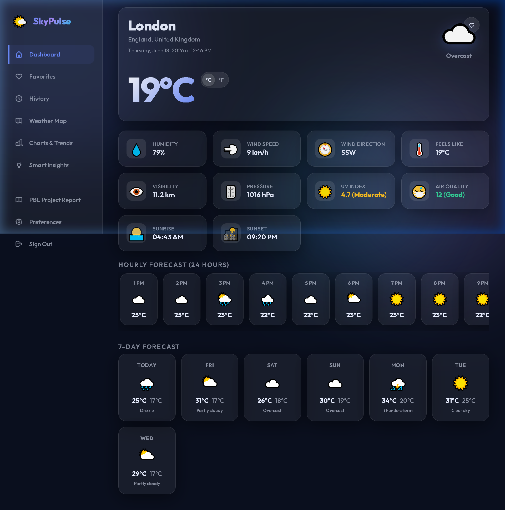

# SkyPulse – Smart Weather Dashboard

[](https://nodejs.org/)
[](https://www.mongodb.com/)
[](LICENSE)

SkyPulse is a professional full-stack **Smart Weather Dashboard** designed as a semester Project-Based Learning (PBL) project for the Web Technology course. It integrates live weather statistics, interactive maps, historic trends, data visualization charts, user profile configurations, and an automated rule-based clothing & travel suggestion engine.



---

## Features

### 🌤️ Weather Statistics
* **Current Weather conditions**: Temperature, humidity, pressure, wind direction & speed, visibility, feels-like.
* **Air Quality Index (AQI)**: Real-time AQI tracking mapping standard levels.
* **UV Index**: Daily solar UV radiations safety scales.
* **24h Hourly & 7-Day Forecasts**: Visual graphs mapping incoming forecasts.

### 👤 User Capabilities & Customizations
* **JWT Authenticated sessions**: Secure signup, login, and profile configurations.
* **Saved Favourite destinations**: Save up to 10 favorite cities for single-click queries.
* **Search History Logs**: Retrieve your recent 20 queries with auto-cleared limits.
* **Theming switch**: Seamless transition toggles between Light and Dark mode styles.
* **Avatar Upload**: Support for custom image profile uploads via local file storage.

### 📊 Data Visualization & Geo-Mapping
* **Interactive Maps**: Powered by Leaflet.js mapping layers, click locations to query weather conditions instantly.
* **Dynamic Graphs**: Powered by Chart.js mapping temperature ranges, wind speeds, and relative humidity trends.

### 🧠 Smart Insights Engine
* **Clothing suggestions**: Rule-based recommendations adjusted based on climate readings.
* **Outdoor Suitability ratings**: Score cards suggesting travel convenience.
* **Automated Weather Alerts**: Highlight warnings for rain risks, freezing coordinates, high wind gusts, and poor air.

---

## Tech Stack

* **Frontend**: Vanilla CSS variables, Modular HTML5 layouts, Vanilla JS modules, [Chart.js](https://www.chartjs.org/), [Leaflet.js](https://leafletjs.com/)
* **Backend**: [Node.js](https://nodejs.org/), [Express.js](https://expressjs.com/) REST APIs
* **Database**: [MongoDB](https://www.mongodb.com/) & [Mongoose](https://mongoosejs.com/) schemas
* **Authentication**: JSON Web Tokens (JWT), Password encryption with `bcryptjs`
* **File Uploads**: `multer` file uploads storage

---

## Folder Structure

```
weather-app-main/
├── server/                          # Express.js REST backend
│   ├── config/                      # Database settings config
│   ├── controllers/                 # MVC Controllers handling logic
│   ├── middleware/                  # JWT auth and validators
│   ├── models/                      # MongoDB database schemas
│   ├── routes/                      # Route maps mapping endpoints
│   └── server.js                    # Core app boots script
│
├── public/                          # Frontend Static Assets
│   ├── css/                         # Clean styled CSS variables files
│   ├── js/                          # Modular JS handlers
│   ├── index.html                   # Auth view template
│   ├── dashboard.html               # Main weather visualizer
│   └── profile.html                 # Profile setting sliders
│
├── uploads/                         # Directory hosting profile pictures
├── docs/                            # PBL documentation and report files
├── .env.example                     # Environment schema template
├── package.json                     # Node script listings
└── README.md
```

---

## Quick Start Setup

### 1. Prerequisites
* Install [Node.js (18+)](https://nodejs.org/)
* Install [MongoDB Community Edition](https://www.mongodb.com/try/download/community)

### 2. Installation steps
Clone this repository locally:
```bash
git clone https://github.com/akramlatif/weather-app.git
cd weather-app
```

Install npm dependencies:
```bash
npm install
```

Configure your local environments file:
```bash
cp .env.example .env
```
Fill variables inside `.env`:
```env
PORT=5000
MONGODB_URI=mongodb://localhost:27017/skypulse
JWT_SECRET=your_jwt_secret_key_string
JWT_EXPIRE=7d
```

### 3. Running development server
Start local MongoDB:
```bash
# Windows Command
net start MongoDB
```

Run application in hot-reload mode:
```bash
npm run dev
```
Open **[http://localhost:5000](http://localhost:5000)** inside your browser.

---

## License
MIT License. Created by Akram.
