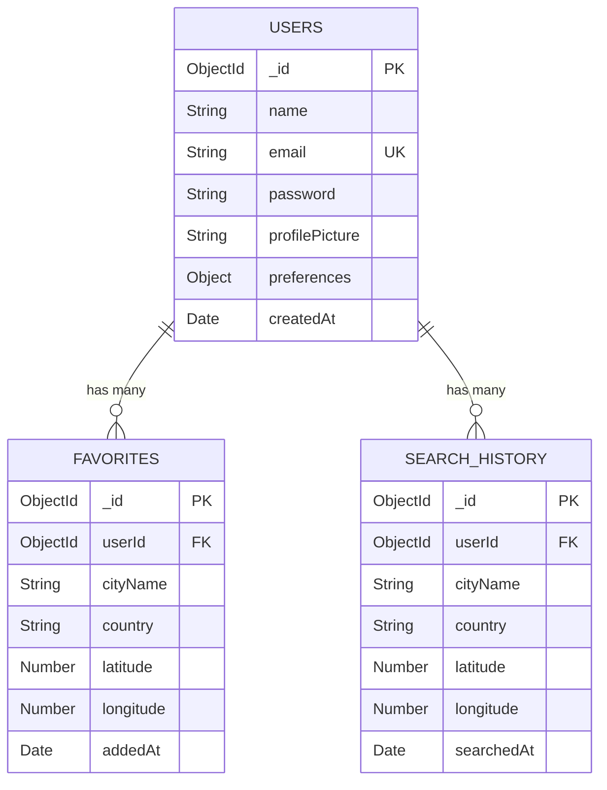

# SkyPulse Database Schema Documentation

SkyPulse uses a document-oriented database powered by MongoDB and structured via Mongoose schemas.

---

## ER Diagram (Relationships mapping)


---

## 1. USERS Collection Schema

* **Index**: `{ email: 1 }` (Unique, ascending)

| Field Name | Data Type | Constraint | Description |
|---|---|---|---|
| `_id` | ObjectId | Primary Key | Autogenerated unique identifier |
| `name` | String | Required, Max 50 chars | Full name of the user |
| `email` | String | Required, Unique, Lowercase | Normalized unique email address |
| `password` | String | Required, Min 6 chars | Salt-hashed password (hidden by default) |
| `profilePicture` | String | Optional, default `""` | Local static uploads image file path |
| `preferences.temperatureUnit` | String | Enum (`"C"`, `"F"`), default `"C"` | Celsius or Fahrenheit setting |
| `preferences.theme` | String | Enum (`"dark"`, `"light"`), default `"dark"` | Active design system theme |
| `createdAt` | Date | Default `Date.now` | Account registration timestamp |

### Example Document
```json
{
  "_id": { "$oid": "603d2b270a6c6a2b8478ff11" },
  "name": "Akram Latif",
  "email": "akram@domain.com",
  "password": "$2a$10$7q5wH1/yG.sK4e8X/zE9HOb...",
  "profilePicture": "/uploads/avatar-16035032.png",
  "preferences": {
    "temperatureUnit": "C",
    "theme": "dark"
  },
  "createdAt": { "$date": "2026-06-01T20:15:30.000Z" }
}
```

---

## 2. FAVORITES Collection Schema

* **Index**: `{ userId: 1, cityName: 1 }` (Unique compound index)

| Field Name | Data Type | Constraint | Description |
|---|---|---|---|
| `_id` | ObjectId | Primary Key | Autogenerated unique identifier |
| `userId` | ObjectId | Foreign Key (ref: `User`) | Reference mapping owning user |
| `cityName` | String | Required, trim | City name query target |
| `country` | String | Optional, trim | Admin/country descriptor |
| `latitude` | Number | Required | Geographic latitude decimal coordinate |
| `longitude` | Number | Required | Geographic longitude decimal coordinate |
| `addedAt` | Date | Default `Date.now` | Bookmark timestamp |

### Example Document
```json
{
  "_id": { "$oid": "603d2b270a6c6a2b8478ff22" },
  "userId": { "$oid": "603d2b270a6c6a2b8478ff11" },
  "cityName": "Karachi",
  "country": "Pakistan",
  "latitude": 24.8607,
  "longitude": 67.0011,
  "addedAt": { "$date": "2026-06-01T21:05:00.000Z" }
}
```

---

## 3. SEARCH_HISTORY Collection Schema

* **Index**: `{ userId: 1, searchedAt: -1 }` (Ascending user, descending searched date)

| Field Name | Data Type | Constraint | Description |
|---|---|---|---|
| `_id` | ObjectId | Primary Key | Autogenerated unique identifier |
| `userId` | ObjectId | Foreign Key (ref: `User`) | Owning user reference |
| `cityName` | String | Required, trim | Searched city name |
| `country` | String | Optional | Country name |
| `latitude` | Number | Optional | Latitude coordinate |
| `longitude` | Number | Optional | Longitude coordinate |
| `searchedAt` | Date | Default `Date.now` | Search timestamp |

### Example Document
```json
{
  "_id": { "$oid": "603d2b270a6c6a2b8478ff33" },
  "userId": { "$oid": "603d2b270a6c6a2b8478ff11" },
  "cityName": "Paris",
  "country": "France",
  "latitude": 48.8566,
  "longitude": 2.3522,
  "searchedAt": { "$date": "2026-06-01T21:10:00.000Z" }
}
```
