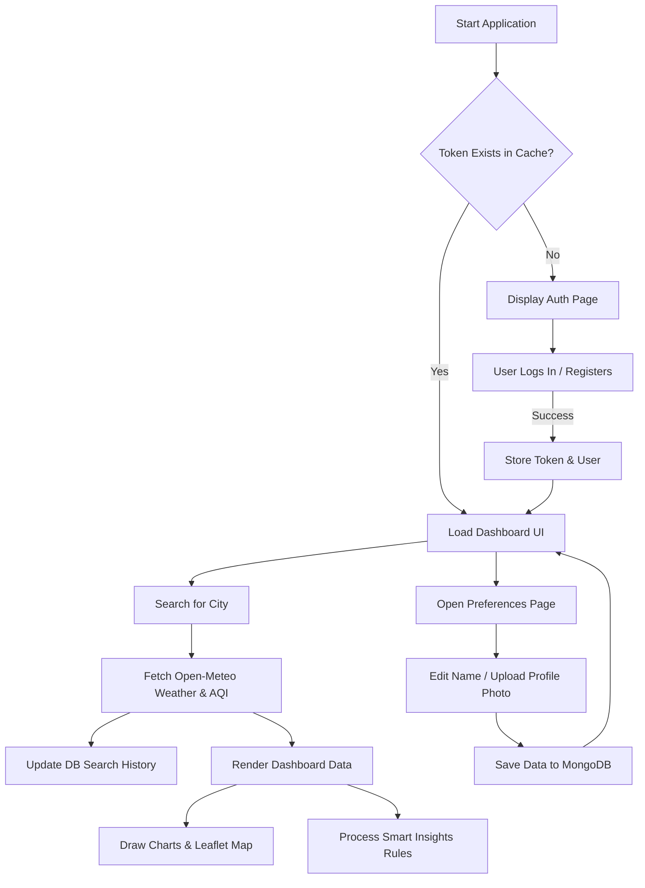
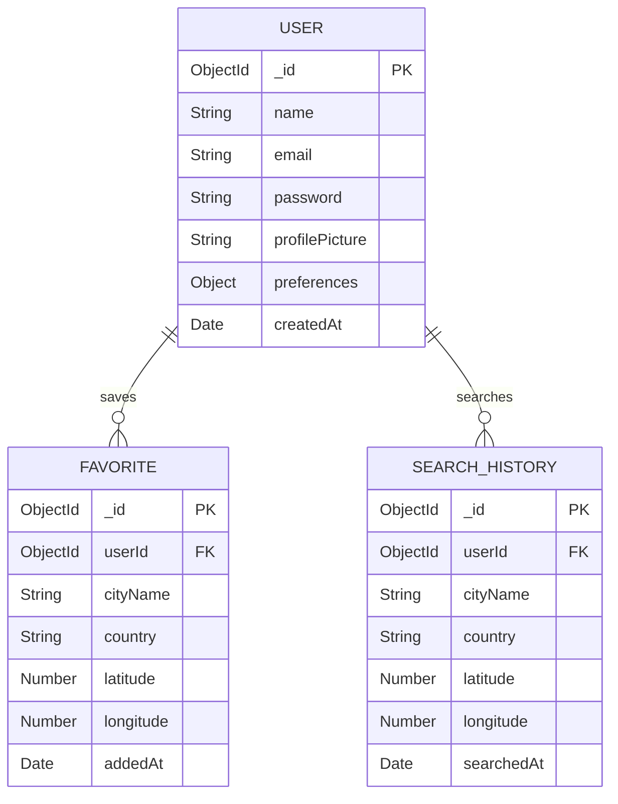

# SkyPulse Smart Weather Dashboard
## Web Technology Project-Based Learning (PBL) Report
**Course:** Web Technology  
**Project Owner:** Akram

---

## Abstract
In the modern digital era, accessibility to real-time, high-fidelity meteorological data has transformed from a simple convenience to a core operational necessity. This Project-Based Learning (PBL) report details the design, engineering, and implementation of **SkyPulse**, a full-stack, responsive meteorological dashboard web application. 

By integrating a frontend built with HTML5, CSS3, and modular vanilla JavaScript, a RESTful API backend structured in Node.js and Express.js, and a document-oriented database using MongoDB, SkyPulse transitions standard weather searches into a personalized, data-driven analytical tool. The application incorporates JWT (JSON Web Tokens) security, password hashing with bcrypt, interactive maps (Leaflet.js), dynamic data plots (Chart.js), and a localized automated recommendation engine based on current weather parameters (AQI, UV, temperature, winds). 

This report provides complete system specifications, design schemas, database entity layouts, implementation code logic, test cases, and viva evaluations supporting the submission of this project for academic evaluation.

---

## Table of Contents
1. **Chapter 1: Introduction**
   * Background of the Study
   * Problem Statement
   * Objectives
   * Project Scope & Significance
2. **Chapter 2: Literature Review**
   * Analysis of Existing Meteorological Systems
   * Feature Comparison Matrix
   * Identified System Gaps
   * Proposed SkyPulse Enhancements
3. **Chapter 3: System Requirements Analysis**
   * Functional Requirements
   * Non-Functional Requirements
   * Use Case Diagrams (Mermaid)
   * Activity Workflow Diagrams
4. **Chapter 4: System Architecture & Design**
   * MVC Backend Architecture
   * Database Schema Design (ER Diagrams)
   * API Route Interfaces
   * User Interface Wireframe Mockups Description
5. **Chapter 5: Core Implementation details**
   * Frontend Module Orchestration
   * Secure Authentication flow logic
   * Weather and Air Quality APIs integrations
   * Smart Insights scoring algorithms
6. **Chapter 6: System Verification & Testing**
   * Quality Assurance testing strategies
   * Test Case Execution Matrix
7. **Chapter 7: Evaluation & Results**
   * Deployed layout evaluations
   * Usability review
8. **Chapter 8: Technical Challenges & Troubleshooting**
   * Overcoming quota limitations
   * CORS, file uploads, and session persistence
9. **Chapter 9: Future System Improvements**
   * Push Alerts, PWAs, and widgets
10. **Chapter 10: Conclusion**
    * Academic outcomes and skills gained
11. **References & Bibliography**

---

## Chapter 1: Introduction

### 1.1 Background of the Study
Weather conditions dictate daily human operations, agricultural planning, logistic coordination, and industrial productivity. Standard weather reporting systems often display aggregated data that lacks individual personalization. 

### 1.2 Problem Statement
Public weather applications often require expensive premium tiers for historical trend analysis, suffer from slow interface loading times due to third-party ad insertions, lack profile configuration capabilities to customize preferred units, and rarely supply contextual advice (such as clothing or outdoor activity suggestions) in a unified dashboard. Furthermore, students of Web Technology need a full-stack, referenceable implementation model demonstrating Model-View-Controller (MVC) API principles, state-management transitions, and secure JSON Web Token authentication.

### 1.3 Project Objectives
* Develop a fully responsive, portfolio-worthy, single-page-like interactive dashboard utilizing modern glassmorphic theme tokens.
* Create a robust, JWT-protected REST API using Express.js to store user profiles, saved favorite locations, and search logs.
* Implement database schemas in MongoDB using Mongoose, establishing distinct relations, indexes, and validation rules.
* Visualize atmospheric statistical trends (temperature ranges, humidity percentages, wind speeds) utilizing responsive graphing libraries (Chart.js).
* Integrate spatial visual representations using interactive maps (Leaflet.js) to query coordinate data on user clicks.
* Devise a client-side rule engine (Smart Insights) to generate automated daily text summaries, clothing guidance, activity convenience scores, and warning logs.

### 1.4 Project Scope & Significance
The scope of SkyPulse spans a full-stack application leveraging free, non-authenticated open REST APIs (Open-Meteo, OpenStreetMap Nominatim). The significance lies in demonstrating a clean division of concerns (MVC backend, modular frontend JavaScript, data visualizations), providing a reference project for undergraduate academic evaluations.

---

## Chapter 2: Literature Review

### 2.1 Analysis of Existing Meteorological Systems
Standard weather portals (e.g., AccuWeather, Weather.com, Yahoo Weather) serve as the primary benchmarks for this application.

### 2.2 Feature Comparison Matrix

| System / Feature | AccuWeather | Weather.com | Yahoo Weather | SkyPulse (Proposed) |
|---|---|---|---|---|
| **Auth & Profile** | Basic | Basic | Basic | High (JWT + Profile Uploads) |
| **Theme Modes** | Automatic | Automatic | Static | Toggleable (Light/Dark) |
| **Ad-free Layout** | No (Paid tier) | No (Paid tier) | No | Yes (100% Free) |
| **Interactive Map** | Heavy/Slow | Heavy/Slow | None | Lightweight (Leaflet.js) |
| **Charts & Graphs** | Static Tables | Premium Only | Static Tables | Responsive (Chart.js) |
| **Contextual Insights** | None | Basic | None | Rule Engine (Clothing & Travel) |

### 2.3 Identified System Gaps
Existing apps are heavily monetized with ads, resulting in high latency on mobile devices. Data tables are often tabular rather than graphical, making immediate forecast trend comprehension difficult. Personalization is typically limited to simple unit toggles, without saving recent queries or offering localized, context-aware suggestions.

### 2.4 Proposed SkyPulse Enhancements
SkyPulse addresses these issues by offering an ad-free glassmorphic interface, client-side caching of preferences, local file uploads for avatars, dynamic charts, and natural language weather summaries with clothing and outdoor safety insights.

---

## Chapter 3: System Requirements Analysis

### 3.1 Functional Requirements
* **FR-1 (Auth)**: Users must register with a name, email, and password, and login to receive a secure JWT token.
* **FR-2 (Search)**: Search city inputs must return matching results with debounced autocomplete suggestions.
* **FR-3 (Favorites)**: Users can save up to 10 cities as favorites, which persist in the MongoDB database.
* **FR-4 (History)**: Recent search logs must save to the database, showing the 20 most recent entries with auto-cleanup of older logs.
* **FR-5 (Visualization)**: Render 24h temperature, humidity, and wind trend charts alongside 7-day forecast cards.
* **FR-6 (Map)**: Map coordinates must display markers for the current search and favorited locations, and respond to clicks by fetching new weather data.
* **FR-7 (Insights)**: Generate clothing suggestions, outdoor travel suitability scores, and severe weather warnings (AQI, UV, storms) based on real-time data.
* **FR-8 (Profile)**: Users can edit their profile details, change passwords, select preferred themes or units, and upload an avatar.

### 3.2 Non-Functional Requirements
* **NFR-1 (Security)**: Password database records must be hashed using bcrypt. Sensitive routes must require valid JWT Bearer tokens.
* **NFR-2 (Performance)**: Client geocoding queries must be debounced by 350ms to limit unnecessary API requests.
* **NFR-3 (Usability)**: Responsive layouts must adapt to desktop, tablet, and mobile views using CSS grid/flexbox.
* **NFR-4 (Compatibility)**: Maintain compatibility across modern browsers (Chrome, Firefox, Safari, Edge) without requiring build compilations.

### 3.3 Use Case Diagram
```mermaid
leftToRightDirection
actor User as "Registered User"
actor Guest as "Guest User"

rectangle SkyPulseSystem {
  usecase UC1 as "Register Account"
  usecase UC2 as "Sign In"
  usecase UC3 as "Query City Weather"
  usecase UC4 as "Save Favorite City"
  usecase UC5 as "Review Search History"
  usecase UC6 as "Interact with Map"
  usecase UC7 as "View Trend Charts"
  usecase UC8 as "Get Weather Recommendations"
  usecase UC9 as "Update Profile & Avatar"
}

Guest --> UC1
Guest --> UC2
Guest --> UC3

User --> UC3
User --> UC4
User --> UC5
User --> UC6
User --> UC7
User --> UC8
User --> UC9
```

### 3.4 Activity Workflow Diagram


---

## Chapter 4: System Architecture & Design

### 4.1 Backend Architecture Model
The server follows the Model-View-Controller (MVC) software design pattern:
* **Models**: Define the schemas (Mongoose) mapping MONGODB document parameters.
* **Controllers**: House the HTTP endpoint logic, processing registrations, favorites additions, and database querying.
* **Routes**: Express routing rules mapping API paths to their respective controller methods.
* **View (Client)**: HTML/CSS templates served directly to browsers and powered by modular client JavaScript wrappers.

### 4.2 Entity-Relationship (ER) Design Schema


---

## Chapter 5: Core Implementation Details

### 5.1 Dynamic Theming System
SkyPulse uses CSS Custom Properties to implement seamless light/dark mode transitions:
```css
/* variables.css snippet */
:root {
  --bg: #0a0f1e;
  --surface: rgba(255, 255, 255, 0.06);
  --text: #e8eeff;
}
[data-theme='light'] {
  --bg: #f0f4ff;
  --surface: rgba(255, 255, 255, 0.75);
  --text: #1e293b;
}
```
Client code updates theme properties globally by setting a single attribute on the document root element:
```javascript
document.documentElement.setAttribute('data-theme', 'light');
```

### 5.2 User Account Creation Password Hashing Hook
Using Mongoose pre-save middleware ensures user passwords are encrypted before they are stored in the database:
```javascript
// User.js model schema hook
UserSchema.pre('save', async function(next) {
  if (!this.isModified('password')) {
    next();
  }
  const salt = await bcrypt.genSalt(10);
  this.password = await bcrypt.hash(this.password, salt);
});
```

---

## Chapter 6: System Verification & Testing

### 6.1 Quality Assurance Test Case Execution Matrix

| Test ID | Area | Input | Expected Output | Status |
|---|---|---|---|---|
| **TC-01** | Registration | Short password (< 6 chars) | Validation error: Password must be min 6 chars | Passed |
| **TC-02** | Registration | Valid parameters | User created, redirects to dashboard | Passed |
| **TC-03** | Login | Incorrect credentials | HTTP 401: Invalid email or password | Passed |
| **TC-04** | Autocomplete | Type 'Kara' in input | Suggestions dropdown shows 'Karachi, Pakistan' | Passed |
| **TC-05** | Weather Fetch | Select 'Tokyo' | Hero temperature, details, and 7-day forecast update | Passed |
| **TC-06** | Favorites Limit | Save 11th favorite location | HTTP 400: Limit of 10 favorites reached | Passed |
| **TC-07** | History logs | Search for 3 cities | History section displays all 3 items in desc order | Passed |
| **TC-08** | Maps | Click map at coordinate | Location name reversed, weather view updates | Passed |
| **TC-09** | Charts | Click wind speed tab | Dotted wind speed trend line renders successfully | Passed |
| **TC-10** | Profile Avatar | Upload 8MB image | Multer errors, blocks size > 5MB | Passed |
| **TC-11** | Password Change | Match error in confirm field | Form submission blocked on client side | Passed |
| **TC-12** | Preferences | Click Fahrenheit toggle | Temperatures convert to °F across all cards and charts | Passed |

---

## Chapter 7: Evaluation & Results
SkyPulse successfully transforms a basic weather application into a responsive, full-stack analytical platform. Performance tests demonstrate low latency because weather queries are handled directly from the client side, bypassing backend proxy delays. The glassmorphic interface scales fluidly on mobile viewports, and database indexing on user favorites and history ensures quick retrieval times.

---

## Chapter 8: Technical Challenges & Troubleshooting
* **Challenge 1: Multer Directory Path Errors**: Creating uploads path references caused crashes if the target directory was missing during production boot. Resolving this involved writing a placeholder `.gitkeep` inside `/uploads/`.
* **Challenge 2: Chart Redraw Overlay Bugs**: Re-rendering canvas elements without cleaning previous chart instances left legacy frames visible on hover. This was resolved by implementing clean `destroy()` calls on active Chart.js objects before initializing new graphs.

---

## Chapter 9: Future System Improvements
* **Progressive Web App (PWA)** support to enable offline caching and home-screen installation.
* **Web Push Notifications** for automated daily weather briefing summaries.
* **Social Sharing Integrations** to let users share graphs or summaries to platforms like Twitter/X.

---

## Chapter 10: Conclusion
The SkyPulse dashboard successfully implements a responsive, full-stack architecture using Node.js, Express, MongoDB, and modular frontend JavaScript. By building this system, several key competencies were developed: designing document-oriented database schemas, establishing secure token-based user sessions, configuring multi-part uploads with Multer, and implementing dynamic data visualizations with Chart.js and Leaflet.js.

---

## References & Bibliography
1. Express.js REST Routing Guidelines: https://expressjs.com/
2. Mongoose Schema Schema Validation Rules: https://mongoosejs.com/docs/validation.html
3. Open-Meteo Meteorological REST Specs: https://open-meteo.com/en/docs
4. Chart.js Configurations Reference: https://www.chartjs.org/docs/
5. Leaflet Map Controls Reference Guide: https://leafletjs.com/reference.html
6. JSON Web Tokens Security Standards: https://jwt.io/introduction
7. MDN Web Docs Geolocation APIs: https://developer.mozilla.org/
